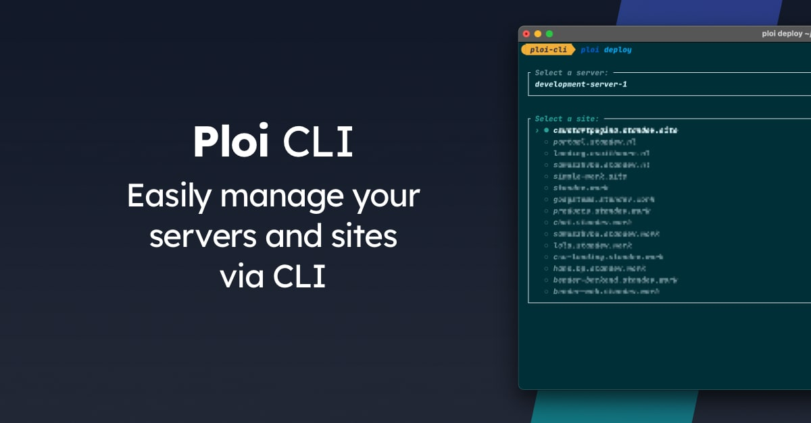

# Ploi CLI

An easy-to-use command line interface for [ploi](https://ploi.io/register).

## Documentation

You can see the full documentation on its [website](https://cli.ploi.io).

### Security
If you discover any security related issues, please email security@ploi.io instead of using the issue tracker.

## Credits

- [Felix Schmid](https://github.com/schmidfelix) (Original author)
- [Stan Menten](https://stanmenten.dev/) (Maintainer)
- [Ploi](https://ploi.io)
- [All Contributors](../../contributors)

## License

The MIT License (MIT). Please see [License File](LICENSE.md) for more information.
